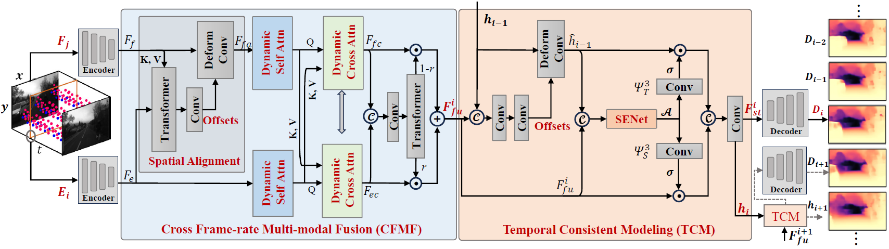

## High-rate monocular depth estimation via cross frame-rate collaboration of frames and events



The pipeline of the proposed high-rate monocular depth estimator using a *cross frame-rate frame-event joint learning network (**CFRNet**)*. The continuous event stream is first split into high-rate event temporal bins and converted into event representations. For the current timestamp $t_i$, we use the modal-specific shared encoder adopting a lightweight CNN-Transformer hybrid backbone (*i.e.,* lite-mono) to extract local-global features from the event representation $E_i$ and the most recent frame $F_j$, respectively. Then, the proposed CFMF utilizes implicit spatial alignment and dynamic attention-based fusion strategies to generate a complementary joint representation. Meanwhile, a novel  recurrent network TCM effectively models long-range temporal dependencies between the joint representations. Finally, a normal CNN-based decoder predicts high-rate and fine-grained depth maps.

#### Dependencies

PyTorch >= 1.0
NumPy
OpenCV
Matplotlib

### Setup
This code has been tested with Python 3.7.10, Torch 1.9.0, CUDA 10.2 on Ubuntu 16.04.

- Setup python environment
```
conda create -n EReFormer python=3.7.10
source activate EReFormer 
pip install -r requirements.txt
conda install -c pytorch pytorch=1.9.0 torchvision cudatoolkit=10.2
conda install -c conda-forge opencv
conda install -c conda-forge matplotlib
```

### Public Datasets

High-rate monocular depth estimation at 100Hz, where the frame modality frame rate is 2.5Hz and the event modality is 100Hz:


